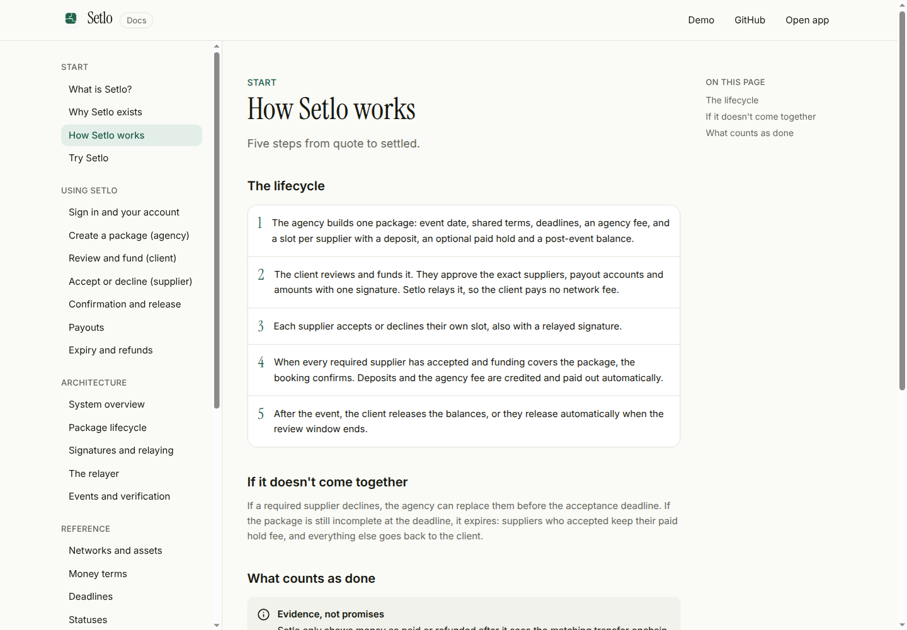
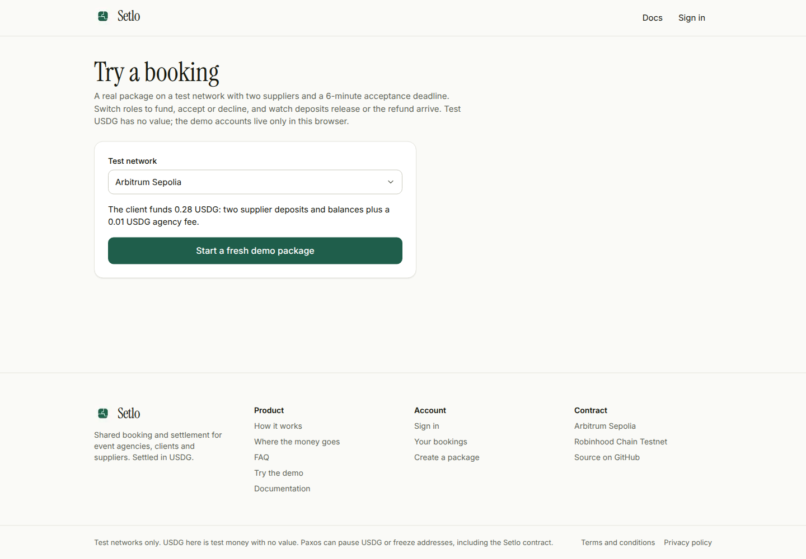
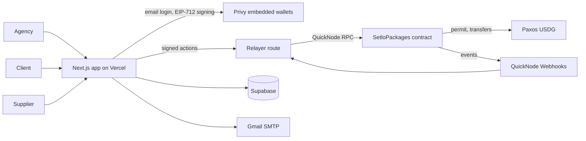

# Setlo

**Book every event supplier together. Release deposits only when all of them say yes.**

Setlo is conditional, multi-party booking and settlement for events, settled in USDG on Arbitrum. An agency puts the venue, caterer, AV and every other supplier into one package. The client funds it once. Each supplier accepts or declines their own slot. Deposits go out only when every required supplier has accepted; if that doesn't happen in time, the client gets the money back, minus the hold fees they approved.

- Live app: https://setlo-mu.vercel.app (test networks, test USDG)
- Try a real booking in two minutes: https://setlo-mu.vercel.app/demo
- Documentation: https://setlo-mu.vercel.app/docs
- Pitch video: https://youtu.be/RQBzFZ27YwI
- Demo video: https://youtu.be/OjwOR2skvLM


## The problem

An event is only booked when every supplier is booked, but today each supplier takes its own deposit, on its own timeline, over email. A client can pay the venue before learning the caterer is unavailable, and then has to chase that deposit back. Agencies sit in the middle chasing confirmations and fronting money, with no shared record of who agreed to what.

## How Setlo works

1. **The agency builds one package**: event date, shared terms, deadlines, an agency fee, and a slot per supplier with a deposit, an optional paid hold and a post-event balance.
2. **The client reviews and funds it** with one signature that approves the exact suppliers, payout accounts and amounts. Setlo relays it, so the client pays no network fee.
3. **Each supplier accepts or declines** their own slot, also gasless.
4. **When every required supplier has accepted**, the booking confirms. Deposits and the agency fee are credited and paid out automatically.
5. **After the event**, the client releases the balances, or they release automatically when the review window ends.

If a required supplier declines, the agency can replace them. If the package is still incomplete at the deadline, it expires: suppliers who accepted keep their paid hold, and everything else is refunded to the client.

Nobody needs a crypto wallet. People sign in with an email code; Setlo creates their payout account (a Privy embedded wallet) and pays the network fees for clients and suppliers.

| Docs | Demo |
| --- | --- |
|  |  |

## Architecture



The contract is the source of truth for money and state. Everything else is coordination and can fail without changing what is owed.

| Component | Technology | Responsibility |
| --- | --- | --- |
| Contract | Solidity, Foundry, OpenZeppelin | Package state machine, custody, acceptance rules, credits and pull-based claims |
| App | Next.js, React, TypeScript, Tailwind, viem | Role screens, signing, reading live state from the chain |
| Auth and wallets | Privy | Email, Google and passkey sign-in; embedded payout wallets |
| Relayer | Vercel route with a hot wallet | Submits a whitelist of signed or permissionless calls and pays gas; pushes payouts with `claimFor` |
| RPC and events | QuickNode RPC and Webhooks | Reads, writes and contract event delivery on both networks |
| Metadata | Supabase Postgres | Drafts, invites, profiles, terms text, tx log, processed events |
| Email | Gmail SMTP | Invites, payout-account setup links, payout notices |
| Token | Paxos USDG (6 decimals) | Funding and payouts |

### Package lifecycle

```
Open ──(last required accept + funding)──▶ Confirmed ──(release after event)──▶ Released
  │                                            └──(cancel before event)──▶ Cancelled
  └──(deadline missed / final expiry)──▶ Expired
```

| Transition | Credited |
| --- | --- |
| Confirm | Accepted deposits to suppliers, agency fee to the agency, unaccepted optional slots back to the client |
| Release | Each booked balance to its supplier |
| Cancel after confirm | Unreleased balances back to the client |
| Expire | Earned hold fees to suppliers who accepted, the remainder to the client |

### Trust boundaries

- The contract is non-upgradeable. The owner can only pause **new** package creation; it can't move, redirect or freeze funds.
- Client funding is an EIP-712 instruction bound to the package's configuration hash, so a USDG permit can't be pointed at another package.
- Supplier acceptances bind the slot's exact terms and the package revision; any change requires re-acceptance.
- Every signature is chain- and contract-bound, single-use (nonce) and time-limited.
- The relayer can only submit calls users signed or that anyone may call, and payouts always go to the recipient's own address.
- Paxos can pause USDG or freeze addresses, including the Setlo contract.

More detail: [architecture](https://setlo-mu.vercel.app/docs/architecture/system-overview), [trust model](https://setlo-mu.vercel.app/docs/security/trust-model), [contracts/README.md](contracts/README.md).

## Deployments (testnet)

| Network | Chain ID | SetloPackages | USDG |
| --- | --- | --- | --- |
| Arbitrum Sepolia | 421614 | [`0xccf304db9ab8607b379b0f7f87cbb4d269a1de73`](https://sepolia.arbiscan.io/address/0xccf304db9ab8607b379b0f7f87cbb4d269a1de73) | `0xFFC95faa3d63Cde504a05B567C600B78C0b41892` |
| Robinhood Chain Testnet | 46630 | [`0xccf304db9ab8607b379b0f7f87cbb4d269a1de73`](https://explorer.testnet.chain.robinhood.com/address/0xccf304db9ab8607b379b0f7f87cbb4d269a1de73) | `0x7E955252E15c84f5768B83c41a71F9eba181802F` |

Both are source-verified on Sourcify (exact match). These are test networks; test USDG has no value.

## Repository

```
contracts/   SetloPackages.sol, Foundry unit, fuzz and invariant tests, deploy and live E2E scripts
app/         Next.js app: UI, API routes (relay, deadlines, webhooks, invites, faucet), Supabase migrations
docs/        README screenshots
```

## Run it locally

Contracts:

```bash
cd contracts
forge build
forge test -vvv
```

App:

```bash
cd app
cp .env.example .env.local   # fill in Privy, Supabase, relayer key, RPC URLs, QuickNode secret, Gmail
pnpm install
pnpm dev                     # http://localhost:3000
```

Checks run in CI:

```bash
pnpm lint && pnpm typecheck && pnpm test && pnpm build
```

## Evidence

- 43 Foundry unit and fuzz tests plus 2 invariant tests (the contract's USDG always covers what it owes).
- `contracts/script/E2E.s.sol` runs a funded, accepted, confirmed and released package and a declined package that expires with a refund, live on a deployed contract.
- `app/scripts/relay-smoke.mjs` runs a full booking through the relayer API with automatic payouts.
- Both live scripts have been run on Arbitrum Sepolia and Robinhood Chain Testnet with sub-dollar amounts, sweeping test payouts back afterwards.

## Limitations

- Test networks and test USDG only.
- No dispute resolution or proof of delivery; balances release when the client approves or the review window ends.
- No business identity verification; suppliers are email-authenticated and approved by the client.
- No in-app send or withdraw of USDG.
- Deadline actions (expire, automatic release) run when a booking page is open or someone presses the button; there is no background scheduler on Vercel Hobby.
- Amounts and payout addresses are public onchain.
